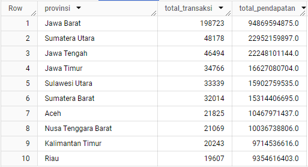
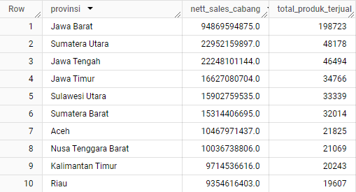
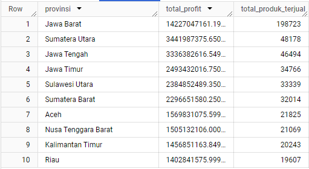
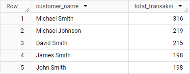
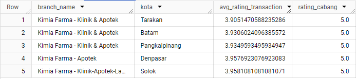
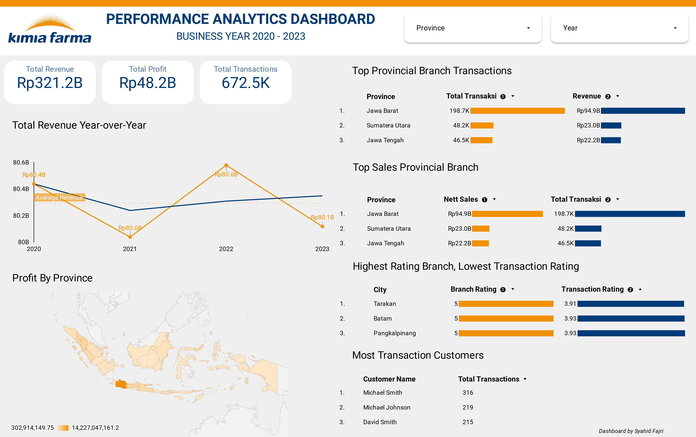

# Kimia Farma Performance Analytics 2020-2023
Tools :
- BigQuery
- Google Looker Studio

## Project Background
Kimia Farma is the first pharmaceutical industrial company in Indonesia which was founded by the Dutch East Indies Government in 1817. As a Big Data Analyst Intern who already understands sales and transaction data for each branch at Kimia Farma, I was asked to create a dashboard for analyzing Kimia Farma's performance for 2020-2023. from the raw data that has been provided. To test my understanding, it is necessary to process the data from start to finish.

## Task 01 : Data Preparation
Before starting data processing, the first step that must be done is to prepare raw data into structured data and ready to be processed. Here's what I did during the Data Preparation Stage:
1. Download datasets given :
   - kf_final_transaction.csv
   - kf_inventory.csv
   - kf_kantor_cabang.csv
   - kf_product.csv
3. Create a new project in BigQuery with the existing name conditions
4. Import a dataset from the data provided, create a new name for the table that is being uploaded to BigQuery, and provide auto-detect on the schema so that it is created automatically

## Task 02 : Data Mart Design
Before designing the Kimia Farma Performance Analysis dashboard, I will create a data mart or analysis table from the raw dataset that was previously uploaded to BigQuery, consisting of the four basic tables and the aggregation results using BigQuery.
<details><summary>SQL Query</summary>

```sql
-- Create Datamart Design --
CREATE TABLE Kimia_Farma.Analysis_Transaction AS
SELECT
    ft.transaction_id,
    ft.date,
    ft.branch_id,
    kc.branch_name,
    kc.kota,
    kc.provinsi,
    kc.rating AS rating_cabang_Kimia_Farma,
    ft.customer_name,
    p.product_id,
    p.product_name,
    ft.price AS actual_price,
    ft.discount_percentage,
    CASE
        WHEN ft.price <= 50000 THEN 0.1
        WHEN ft.price > 50000 - 100000 THEN 0.15
        WHEN ft.price > 100000 - 300000 THEN 0.2
        WHEN ft.price > 300000 - 500000 THEN 0.25
        When ft.price > 500000 THEN 0.30
        ELSE 0.3
    END AS persentase_gross_laba,
    ft.price * (1 - ft.discount_percentage) AS nett_sales,
    (ft.price * (1 - ft.discount_percentage) * 
        CASE
            WHEN ft.price <= 50000 THEN 0.1
            WHEN ft.price > 50000 - 100000 THEN 0.15
            WHEN ft.price > 100000 - 300000 THEN 0.2
            WHEN ft.price > 300000 - 500000 THEN 0.25
            WHEN ft.price > 500000 THEN 0.30
            ELSE 0.3
        END) AS nett_profit,
    ft.rating AS rating_transaksi
FROM
    Kimia_Farma.kf_final_transaction AS ft
LEFT JOIN
    Kimia_Farma.kf_kantor_cabang AS kc ON ft.branch_id = kc.branch_id
LEFT JOIN
    Kimia_Farma.kf_product AS p ON ft.product_id = p.product_id
;

-- Create Aggregate Table 1: Pendapatan Pertahun --
CREATE TABLE Kimia_Farma.pendapatan_pertahun AS
SELECT
    EXTRACT(YEAR FROM st.date) AS tahun,
    SUM(nett_sales) AS pendapatan,
    AVG(nett_sales) AS avg_pendapatan
FROM
    Kimia_Farma.Analysis_Transaction AS st
GROUP BY
    tahun
ORDER BY
    tahun
;

-- Create Aggregate Table 2: Total Transaksi Provinsi --
CREATE TABLE Kimia_Farma.total_transaksi_provinsi AS
SELECT 
    provinsi,
    COUNT(*) AS total_transaksi,
    SUM(nett_sales) AS total_pendapatan
FROM 
    Kimia_Farma.Analysis_Transaction AS st
GROUP BY 
    provinsi
ORDER BY 
    total_transaksi DESC
LIMIT 10
;

-- Create Aggregate Table 3: Nett Sales Provinsi --
CREATE TABLE Kimia_Farma.nett_sales_provinsi AS 
SELECT 
    provinsi, 
    SUM(nett_sales) AS nett_sales_cabang,
    COUNT(st.product_id) AS total_produk_terjual
FROM 
    `Kimia_Farma.Analysis_Transaction` AS st
GROUP BY 
    provinsi
ORDER BY 
    nett_sales_cabang DESC
LIMIT 10
;

-- Create Aggregate Table 4: Total Profit Provinsi --
CREATE TABLE Kimia_Farma.total_profit_provinsi AS
SELECT
    provinsi,
    SUM(nett_profit) AS total_profit,
    COUNT(product_id) AS total_produk_terjual
FROM 
    `Kimia_Farma.Analysis_Transaction` AS st
GROUP BY 
    provinsi
ORDER BY
    total_profit DESC, total_produk_terjual DESC
;

-- Create Aggregate Table 5: Jumlah Transaksi Customer --
CREATE TABLE Kimia_Farma.jumlah_transaksi_customer AS
SELECT
    customer_name,
    COUNT(transaction_id) AS total_transaksi
FROM 
    Kimia_Farma.Analysis_Transaction AS st
WHERE 
    EXTRACT(YEAR FROM date) BETWEEN 2020 AND 2023
GROUP BY 
    customer_name
ORDER BY 
    total_transaksi DESC
LIMIT 5
;

-- Create Aggregate Table 6: Cabang Rating Tertinggi, Rating Transaksi Rendah --
CREATE TABLE Kimia_Farma.cabang_rating_tertingi_rating_transaksi_terendah AS
SELECT
    kc.branch_name,
    kc.kota, 
    AVG(ft.rating) AS avg_rating_transaction, 
    kc.rating AS rating_cabang
FROM 
    `Kimia_Farma.kf_final_transaction` AS ft
LEFT JOIN 
    Kimia_Farma.kf_kantor_cabang AS kc
ON 
    ft.branch_id = kc.branch_id
GROUP BY 
    kc.branch_name, kc.kota, kc.rating
ORDER BY 
    kc.rating DESC, AVG(ft.rating) ASC
LIMIT 5
;
```

</details>


<p align="center">Fig.1. Data Mart Design</p>

\
Fig.2. Aggregate Table 1 (Pendapatan Pertahun)

\
Fig.3. Aggregate Table 2 (Total Transaksi Provinsi)

\
Fig.4. Aggregate Table 3 (Nett Sales Provinsi)

\
Fig.5. Aggregate Table 4 (Total Profit Provinsi)

\
Fig.6. Aggregate Table 5 (Jumlah Transaksi Customer)

\
Fig.7. Aggregate Table 6 (Cabang Rating Tertinggi Namun Rating Transaksi Rendah)

## Task 03 : Dashboard Design
After designing a Data Mart or table analysis from the dataset provided, I created a Kimia Farma Performance Analysis Dashboard from 2020-2023 based on the aggregate table created previously. For Interactive Dashboard please click [this link](https://lookerstudio.google.com/reporting/63e3c832-aafe-43b7-9ef2-87f01d765f55)


<p align="center">Fig.7. [Kimia Farma Performance Analytics Dashboard](https://lookerstudio.google.com/reporting/63e3c832-aafe-43b7-9ef2-87f01d765f55)</p>

From the dashboard, some insights can be seen as follows :
- There was a significant increase in income in 2022 by 68% from 31 provincial branches, with total transactions in 2022 of around 168 thousand, especially in the West Java provincial branch with the highest total income and transactions.
- The explanation that can be developed is that 2022 is the recovery period for COVID-19 and the omicron variant is rampant in Indonesia with several other health issues. The symptoms of COVID-19 caused by the Omicron variant are mild. However, because of its mild symptoms, Omicron is said to be more easily transmitted than other variants. So that it creates a condition in which people care about their physical health.

The insights above also can be converted into marketing strategies as below :
- Launching a health promotion campaign that focuses on post-pandemic healthy living. Highlight the increasing need for vitamins as well as the need for health protocols such as masks and hand sanitizers, as important products for maintaining health during the post-pandemic recovery period.
- Because there is a significant increase in sales in certain provinces, implement local promotions tailored to the circumstances of each branch. Offer branch-specific discounts or incentives to encourage customers to make repeat purchases or transactions at that branch.

Source : https://www.cnnindonesia.com/gaya-hidup/20221219125221-255-889240/geger-kesehatan-di-tahun-2022-banyak-penyakit-misterius-muncul
